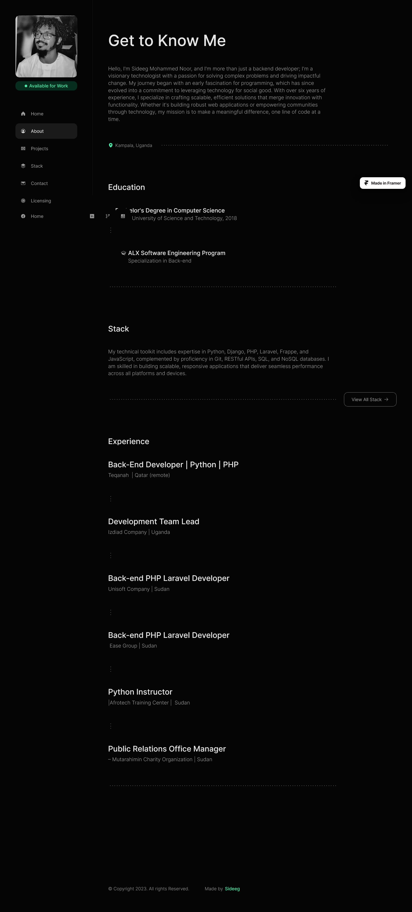
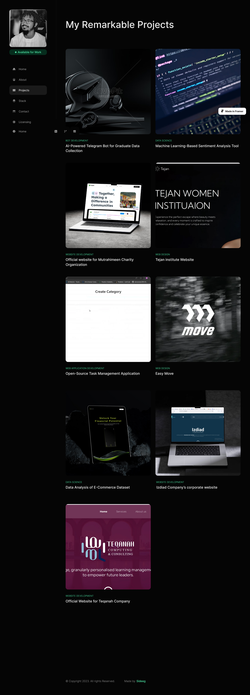

# 🚀 Personal Portfolio

Welcome to my personal portfolio! This project showcases my expertise as a **Full-Stack Developer**, featuring a collection of projects that highlight my skills in **Python, Django, PHP, Laravel**, and other technologies.

## 🔥 Features
- Modern, minimalist, and responsive design.
- Showcases diverse projects, from backend development to AI-driven solutions.
- Interactive and dynamic UI for seamless navigation.
- SEO-optimized to enhance online visibility.
- Fully responsive and mobile-friendly.

## 🛠 Technologies Used
- **Frontend:** HTML, CSS, JavaScript, Bootstrap
- **Version Control:** Git, GitHub
- **Deployment:** Docker, AWS, Vercel

## 📌 Installation & Setup
1. Clone the repository:
   ```sh
   git clone https://github.com/your-username/my-portfolio.git
   ```
2. Navigate to the project folder:
   ```sh
   cd your-portfolio
   ```
3. Open `index.html` in your browser or deploy using a static hosting service.

## 📷 Screenshots
  
   
## 📢 Contact
- **LinkedIn:** https://www.linkedin.com/in/sideeg-mohammed-6ba443185/
- **Email:** sideegmohammednnor@gmail.com
- **Website:** 

---
Feel free to explore my portfolio, provide feedback, or reach out for collaborations! 🚀